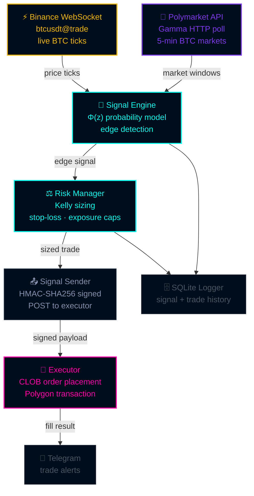

<div align="center">
  
</div>

<div align="center">
  <a href="#">
    
  </a>
</div>

<br/>

<div align="center">

[](https://python.org)
[](https://polymarket.com)
[](https://chain.link)
[](https://binance.com)
[](LICENSE)

</div>

<br/>

```
╔══════════════════════════════════════════════════════════════════════════════╗
║  WARNING: This is a live trading system. Always validate in WATCH → PAPER   ║
║  mode before switching to LIVE. Never skip this step.                        ║
╚══════════════════════════════════════════════════════════════════════════════╝
```

---

## `> WHAT_IS_THIS.exe`

Polymarket runs **5-minute BTC Up/Down binary markets** — bets on whether BTC closes above or below a reference price at expiry. That reference price is set via **Chainlink oracle** at market open.

The exploit:

```
In the final 10–20 seconds, the outcome is nearly certain.
BTC is either clearly up or clearly down.
Market makers reprice slowly.
That lag = positive expected value.
```

This scanner runs 24/7, watching every active BTC market, and fires the moment mispricing exceeds your edge threshold.

---

## `> HOW_IT_WORKS.exe`

### The probability model

As a market approaches expiry, the probability of UP winning is modeled as a Gaussian random walk. The further BTC has moved from the reference price — and the less time remains — the closer true probability is to 0 or 1.

```
P(UP wins) = Φ(z)

         (BTC - REF) / REF
z = ─────────────────────────────
      σ × √( time_remaining / 300 )

Φ  = standard normal CDF
σ  = 5-min BTC return volatility  (~0.28%)
```

When our model probability diverges from the market price by more than `min_edge_bps`, a signal fires.

### Position sizing

Quarter-Kelly with hard exposure caps — aggressive enough to compound, conservative enough to survive variance:

```python
kelly_full  = edge / (1 - entry_price)
kelly_sized = kelly_full × 0.25               # fractional Kelly
size        = min(kelly_sized × bankroll,      # Kelly-suggested
                  bankroll × max_risk_per_trade)  # hard cap (2%)
```

---

## `> ARCHITECTURE.exe`



**The scanner never touches your wallet.** Only the executor holds `POLY_PRIVATE_KEY` — keep it on a separate machine.

---

## `> QUICKSTART.exe`

<details open>
<summary><code>[ STEP 1 — INSTALL ]</code></summary>

<br/>

```bash
git clone https://github.com/LORD-ZYTHOZ/poly-oracle-edge-public
cd poly-oracle-edge-public

python3 -m venv .venv && source .venv/bin/activate
pip install -r requirements.txt
```

</details>

<details open>
<summary><code>[ STEP 2 — CONFIGURE ]</code></summary>

<br/>

```bash
cp .env.example .env
# Set TRADING_MODE=watch first — zero risk, signals only
```

Generate Polymarket CLOB credentials (live mode only):

```bash
PRIVATE_KEY=0xyour_key python scripts/generate_api_keys.py
```

</details>

<details open>
<summary><code>[ STEP 3 — RUN ]</code></summary>

<br/>

```bash
# Watch mode — log signals, no orders
python main.py

# A/B split configs
python main.py config/split_a.yaml   # tight 15s window, 1% edge
python main.py config/split_b.yaml   # wide 60s window, 5% edge

# Keep alive with PM2
pm2 start pm2.config.js
```

</details>

<details>
<summary><code>[ STEP 4 — BACKTEST ]</code></summary>

<br/>

```bash
# Requires: data/btc_ticks.csv + data/poly_markets.jsonl
python scripts/run_backtest.py
```

</details>

---

## `> CONFIG.exe`

```yaml
# config/default.yaml

# ── signal ───────────────────────────────────
lookback_seconds:  15      # scan window before expiry
min_edge_bps:     500      # 5% minimum edge to fire
min_liquidity_usd: 200     # skip thin markets

# ── volatility model ─────────────────────────
sigma_5min:       0.0028   # calibrate from backtester output

# ── risk ─────────────────────────────────────
kelly_fraction:    0.25    # quarter-Kelly (conservative)
max_risk_per_trade: 0.02   # max 2% bankroll per trade
max_open_exposure:  0.10   # max 10% simultaneous exposure
daily_stop_loss:    0.05   # halt if down 5% on the day
```

### Trading modes

```
  WATCH ──────────▶ PAPER ──────────▶ LIVE
  signals only      simulated orders   real CLOB
  (start here)      (validate here)    (earn here)

  ⚠️  Never skip stages.
```

---

## `> SECURITY.exe`

<details>
<summary><code>[ READ BEFORE GOING LIVE ]</code></summary>

<br/>

```
✓  POLY_PRIVATE_KEY  — never in this repo. .env only. Executor machine only.
✓  HMAC-SHA256       — every scanner → executor signal is signed.
✓  Executor isolation — only component that touches your wallet.
✓  SQLite WAL files  — excluded from .gitignore. Never committed.
✓  Tailscale         — bind executor to Tailscale IP. Don't expose 8420 publicly.
```

Generate a shared secret:

```bash
python3 -c "import secrets; print(secrets.token_hex(32))"
```

Copy into both `.env` files as `EXECUTOR_SECRET`.

</details>

---

## `> STRUCTURE.exe`

```
poly-oracle-edge/
│
├── main.py                        ← scanner entrypoint
├── config/
│   ├── default.yaml               ← base parameters
│   ├── split_a.yaml               ← A/B: tight window, low threshold
│   ├── split_b.yaml               ← A/B: wide window
│   └── split_c.yaml               ← A/B: custom
│
├── src/
│   ├── core/
│   │   ├── signal_engine.py       ← Gaussian Φ(z) model + edge detection
│   │   └── state_tracker.py       ← in-memory market registry
│   ├── feeds/
│   │   ├── btc_feed.py            ← Binance WebSocket
│   │   └── poly_feed.py           ← Polymarket Gamma API poller
│   ├── risk/
│   │   └── risk_manager.py        ← Kelly · stop-loss · exposure caps
│   ├── execution/
│   │   ├── polymarket_client.py   ← CLOB order placement (timeout-safe)
│   │   └── signal_sender.py       ← HMAC-signed POST to executor
│   ├── monitoring/
│   │   ├── dashboard.py           ← Rich CLI live dashboard
│   │   ├── logger.py              ← SQLite signal + trade logger
│   │   └── telegram.py            ← Telegram trade alerts
│   ├── backtest/
│   │   ├── backtester.py          ← historical replay engine
│   │   ├── data_loader.py         ← CSV/JSONL loader
│   │   └── metrics.py             ← Sharpe · win rate · EV · drawdown
│   └── models.py                  ← immutable dataclasses throughout
│
├── scripts/
│   ├── generate_api_keys.py       ← derive Polymarket CLOB credentials
│   └── run_backtest.py            ← backtest + print metrics table
│
└── tests/
    ├── test_signal_engine.py      ← probability model unit tests
    ├── test_risk_and_feed.py      ← RiskManager + feed parser tests
    └── test_scanner.py            ← throttle · dedup · ref_price tests
```

---

## `> TESTS.exe`

```bash
pytest tests/ -v --tb=short
```

---

## `> DISCLAIMER.exe`

```
This is experimental research software.
Polymarket regulations vary by jurisdiction.
This is not financial advice.
Never risk money you cannot afford to lose.
```

---

<div align="center">
  
</div>
